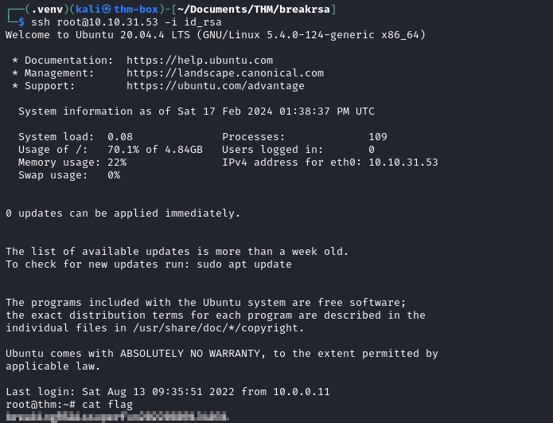

# Breaking RSA (THM)

## RSA Basics
RSA keys are, among other usecases, used for public key authentication to authenticate against a server running SSH to remotely control this server. An RSA key typically consists of the following:
- `e`: Public exponent, usually set to `65537`
- `n`: Public modulus of the public-private-key pair. It is a product of 2 large random prime numbers `p` and `q`
- `d`: Private key; Large positive integer and is calculated as: $d = modinv(e, lcm(p-1, q-1))$

The tuple `(e, n)` makes up the public key, while `d` is the private key calculated using `p` and `q`.

The fact that the factorization problem to somehow factorize `n` to get the two prime numbers `p` and `q` is usually very difficult, makes it hard to brute force the private key. Nevertheless, if the two prime numbers happen to be very close to each other, it becomes almost trivial to factorize `n` into those two prime numbers using [Fermat's factorization algorithm](https://en.wikipedia.org/wiki/Fermat's_factorization_method). This is also what this CTF is all about.

## Recon
First let's find out which ports are open using `nmap`:
```console
nmap -sV 10.10.232.65
```


We see that ports `22` and `80` are open. We also see that on port `80` a webserver is running, so let's have a look at it in the browser.

As we can see there is nothing interesting about the index page. So let's search for other existing paths/directories using `gobuster`
```console
gobuster dir -u http://10.10.232.65 -w /usr/share/wordlists/dirbuster/directory-list-2.3-medium.txt
```
There we find another directory under the path `/development`. Let's access it:

Nice, it seems someone forgot about this path and even let behind a public key and a note. The public key and its associated yet unknown private key are most likely used for SSH authentication according to the note. Also the note tells us that the software used to create the RSA key is using two prime numbers that are very close to each other, hence we can probably use the `Fermat's factorization` algo to eventually get the private key. So now we have everything to get started! 

**Public key `id_rsa.pub`**
```
ssh-rsa AAAAB3NzaC1yc2EAAAADAQABAAACAQDrZh8oe8Q8j6kt26IZ906kZ7XyJ3sFCVczs1Gqe8w7ZgU+XGL2vpSD100andPQMwDi3wMX98EvEUbTtcoM4p863C3h23iUOpmZ3Mw8z51b9DEXjPLunPnwAYxhIxdP7czKlfgUCe2n49QHuTqtGE/Gs+avjPcPrZc3VrGAuhFM4P+e4CCbd9NzMtBXrO5HoSV6PEw7NSR7sWDcAQ47cd287U8h9hIf9Paj6hXJ8oters0CkgfbuG99SVVykoVkMfiRXIpu+Ir8Fu1103Nt/cv5nJX5h/KpdQ8iXVopmQNFzNFJjU2De9lohLlUZpM81fP1cDwwGF3X52FzgZ7Y67Je56Rz/fc8JMhqqR+N5P5IyBcSJlfyCSGTfDf+DNiioRGcPFIwH+8cIv9XUe9QFKo9tVI8ElE6U80sXxUYvSg5CPcggKJy68DET2TSxO/AGczxBjSft/BHQ+vwcbGtEnWgvZqyZ49usMAfgz0t6qFp4g1hKFCutdMMvPoHb1xGw9b1FhbLEw6j9s7lMrobaRu5eRiAcIrJtv+5hqX6r6loOXpd0Ip1hH/Ykle2fFfiUfNWCcFfre2AIQ1px9pL0tg8x1NHd55edAdNY3mbk3I66nthA5a0FrKrnEgDXLVLJKPEUMwY8JhAOizdOCpb2swPwvpzO32OjjNus7tKSRe87w==
```
## RSA analysis
To find the length of the discovered RSA key we can use the `ssh-keygen` utility.
```console
ssh-keygen -l -f id_rsa.pub
```


Next, we want to find out what the modulus of the public-private-key pair `n` is. For that we can use Python with the [`pycryptodomex`](https://pypi.org/project/pycryptodomex/) package. Then we can get `n` in a REPL session:


## Getting the private key

Finally it's time to apply `Fermat's factorization` algorithm to get `p` and `q`. A possible implementation of the algorithm in Python is shown below. Since `n` is quite large, the code uses the [`gmpy2`](https://pypi.org/project/gmpy2/) package to do the initial integer square operation.
```python
from gmpy2 import isqrt_rem

def fermat_factor(n):
    if (n % 2) == 0:
        return (n/2, 2)
    
    a, rem = isqrt_rem(n)
    b = 0
    
    while rem > 0:
        a = a + 1
        b2 = a * a - n
        b, rem = isqrt_rem(b2)
    
    return (a + b, a - b)
```

We can now use this implementation together with the `pycryptodomex` package to first get the two parameters: `p` and `q` and then calculate `d`. Afterwards we can construct the private key and eventually export it to a file.
```python
from Cryptodome.PublicKey import RSA
from math import lcm

def get_public_key(path):
    f = open(path, "r")
    public_key = RSA.import_key(f.read())
    f.close()
    return public_key

def pwn():
    public_key = get_public_key("id_rsa.pub")

    n = public_key.n
    e = public_key.e

    p, q = fermat_factor(n)

    d = pow(public_key.e, -1, lcm(p-1, q-1))

    private_key = RSA.construct((n, e, d))

    with open("id_rsa", "wb") as f :
        f.write(private_key.export_key())

    print("\033[95m###########\033[0m")
    print("\033[95m# RSA PWN #\033[0m")
    print("\033[95m###########\033[0m")    

    print("\033[94mn:\033[0m", n)
    print("\033[94me:\033[0m", e)
    print("\033[94mp:\033[0m", p)
    print("\033[94mq:\033[0m", q)
    print("\033[94md:\033[0m", d)
    print("\033[94mDiff between p & q:\033[0m", p-q)
    print("\033[92mPrivate key has been successfully exported to the file \033[4mid_rsa\033[0m")


if __name__ == "__main__":
    pwn()

```


## Accessing the system
Now that we got the private key we can try to SSH into the machine using the `root` user:
```console
ssh root@10.10.232.65 -i id_rsa
```
Which only works if the file permissions for the `id_rsa` file, holding the private key, are **NOT** too open (i.e., do `chmod 600 id_rsa`). 

Fantastic - that worked seamlessly. Now we have root privilege on this machine. To finish things up we can now access the flag.


Happy hacking!

> mineiwik
